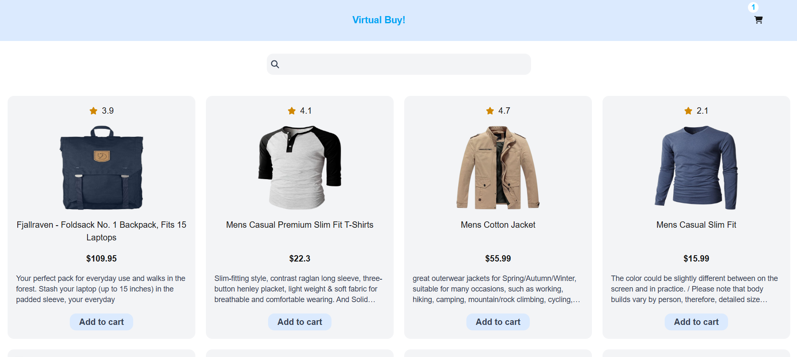
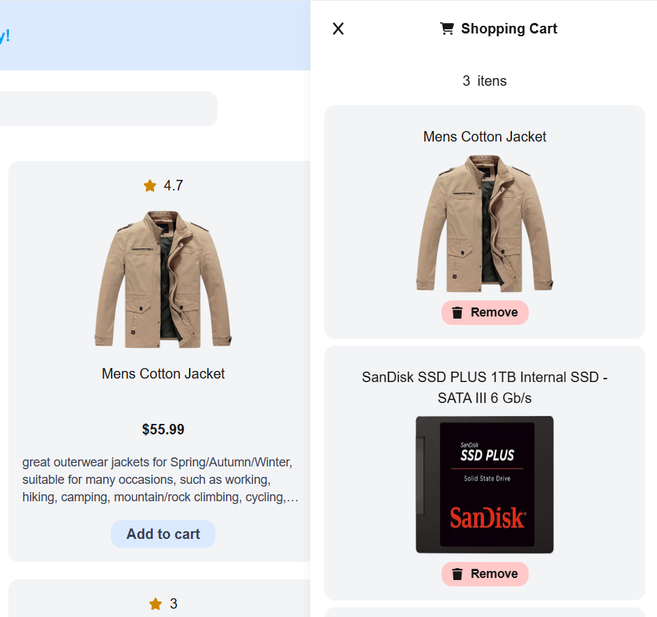
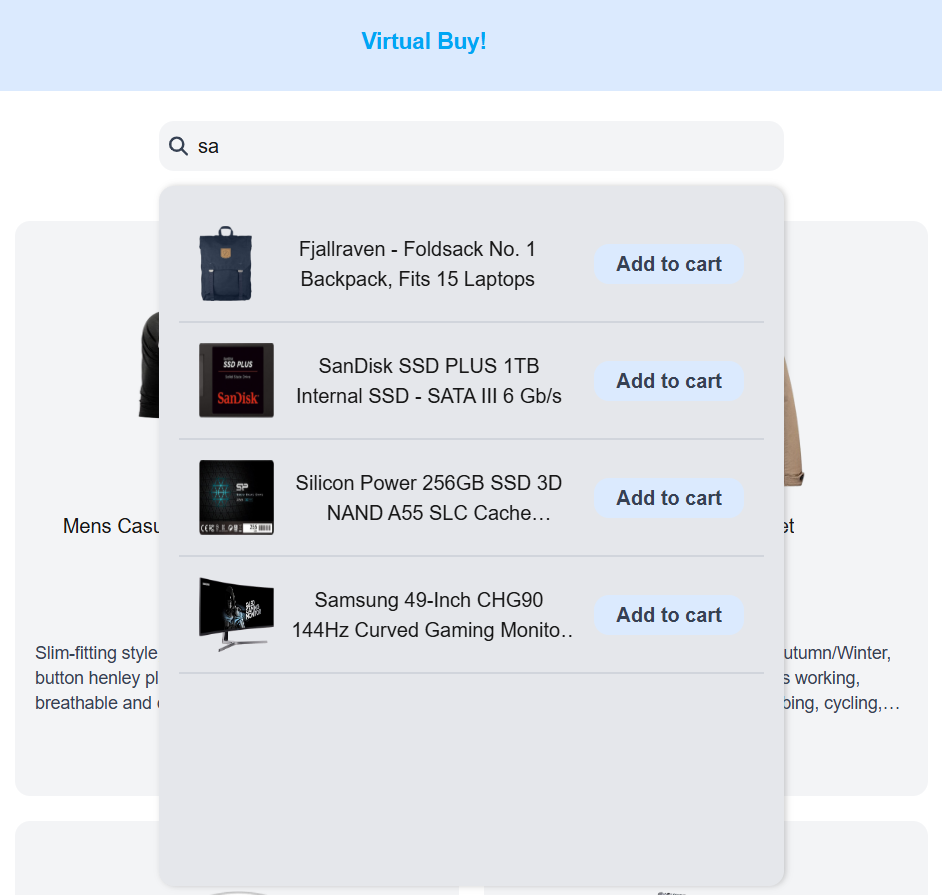

# Virtual Buy! - Uma aplicação web para comprar seus produtos favoritos a qualquer momento!

**Virtual Buy!** é uma aplicação web moderna desenvolvida para oferecer uma experiência de compras online de forma simples e intuitiva.

## Funcionalidades

**Página inicial:** Navegue e escolha qualquer produto que deseja adquirir.

**Carrinho:** Gerencie os itens selecionados no carrinho. Qualquer produto adicionado pode ser removido aqui.

**Barra de pesquisa:** Pesquise produtos facilmente dentro da barra de pesquisa. Qualquer item pesquisado encontrado possui um botão de atalho para adicionar ao carrinho.

**Botão de Adicionar ao Carrinho:** Permite adicionar  rapidamente produtos ao carrinho com um único clique.

**Botão de Remover do Carrinho:** Permite remover  facilmente qualquer item indesejado do carrinho.

## 🔗 Deploy
Projeto disponível em https://dev-jr-desafio-temporary.vercel.app/ — uma loja virtual desenvolvida com **Next.js** e hospedada na **Vercel**.
